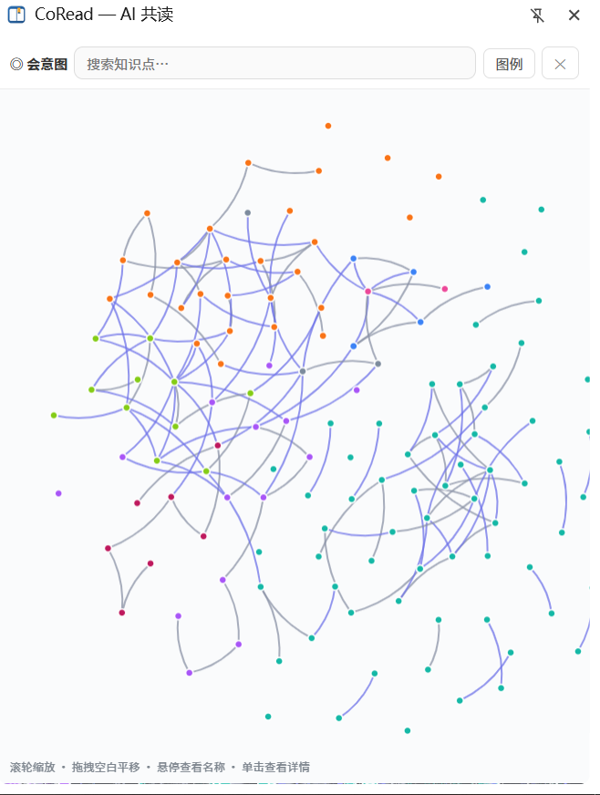
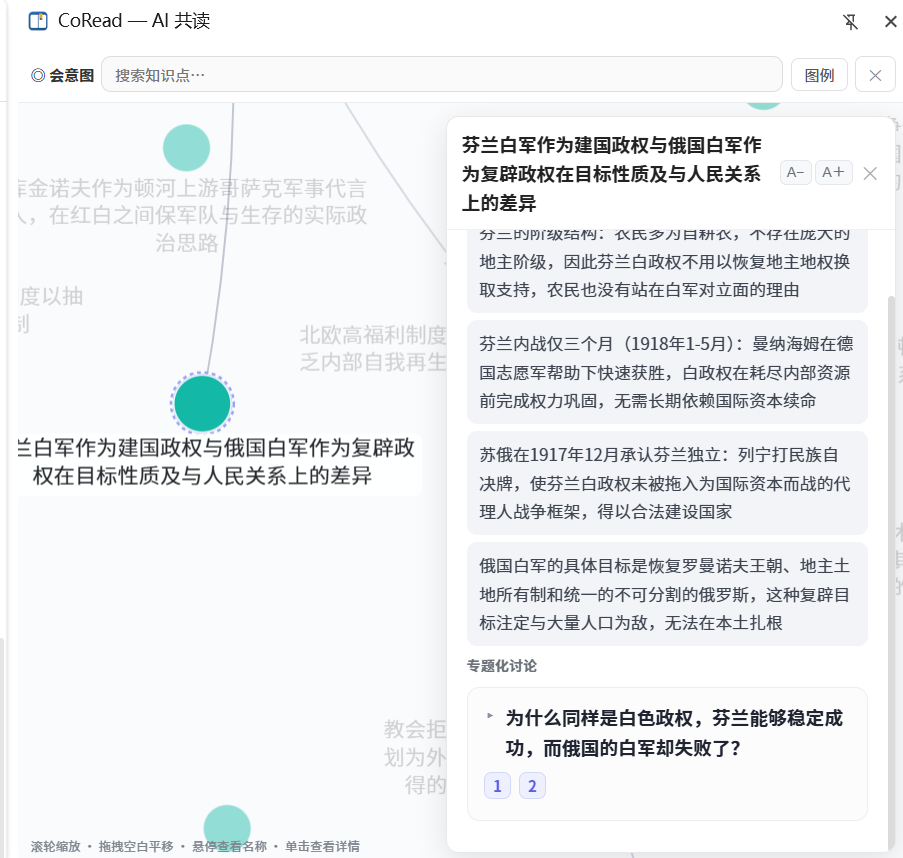

# 📖 读的书散落一地，自己的体系一直没长出来

> *We read to know we are not alone.*

---

## 先说我为什么要做这个东西

书读了不少，好句子划了一堆，别人提起什么你都能接上两句。

但真有人问你"那你自己怎么看"，你会发现——你脑子里是一堆**散装的观点**，说不清哪来的、彼此什么关系，更说不清哪一条是你自己的。

问题不出在读书上。是**缺一套自己的框架**。

书是砖，框架是房子。没有人能替你把房子盖起来，市面上那些"三分钟读懂某学派"也没用——那是别人的房子，你搬进去住，照样没有自己的立足点。

**我想做的是这件事：它从你真正读过的书出发，帮你一点点搭起属于你自己的那套东西。**

不是帮你读得更快，也不是让你多知道几个人名。是让你读的每一次、聊的每一场，都落在**你自己的那条线**上。读一年回头看，你会发现自己已经有了一套别处找不到的说法。

所以我做了 CoRead。名字是「共读」，但目的不是陪你读——是陪你把东西长出来。怎么做到？靠下面这几件别人不愿意做的事：

---

## 它跟别的 AI 读书工具，到底哪里不一样

别的工具想让你**读懂这本书**，最后你知道了很多关于书的说法。CoRead 想让你**长出你自己的体系**，最后你有了自己的判断。下面四条，前三条是地基，第四条是心脏：

### 1️⃣ 它只读到你读到的地方，一步都不多 🚫

它明明"知道"后面发生什么，但它不用。它只能看见**你已经读过、并且已经被缓存到本地的那几章原文**——读到第几章，它的世界就只有那么大。

你问一个后文才揭晓的问题，它会说：

> "这个问题书的后面会回应，读到再聊。"

**不剧透，不抢答，不拿训练知识糊弄你。**

这不是为了防剧透。它换来的是**平等**：它和你掌握的信息一样多，所以你们是在同一条起跑线上讨论，而不是它在给你讲解、你负责点头。你自己体系的地基，必须从"你真正读懂的那部分"上起——不能外包给一个已经知道答案的东西。

（术语翻译一下：这叫「进度门控」，意思是给 AI 的视野装了一道闸门，闸门的位置就是你当前读到的地方。这是 CoRead 的**产品设计**，不是技术没做到。）

### 2️⃣ 它逼你有观点 💬

你的理论体系不是攒出来的，是**磨出来**的。所以它绝不能只会附和你。

它复述原文是被禁止的，给的必须是自己的判断：赞同、质疑，或者反问你一句。

你划"人不该被出身决定"，它可能回你：

> "这话听着热血，但书里第三章那位主角的选择恰恰相反——你确定作者是这么想的？"

你有观点，它就跟你碰——同意或反对都落在具体内容上，不给你模棱两可的客套。**几年下来你会有一套自己的判断，因为从来没人替你做过判断。**

它被明令禁止说这些："你好呀"、"很高兴为你解答"、"你说得对！"、"真棒！"——那种一听就是客服的话。

### 3️⃣ 它记得你，而且是"重新写一遍"，不是越堆越多 🧠

它有两个长期记忆文件：

| | 里面是什么 |
|---|---|
| **你的画像** | 你在读什么、关心什么、反复回到哪些问题上、习惯怎么想事情 |
| **它的自画像** | 它在这段关系里形成的立场、你们的共识与分歧、它学会的跟你相处的方式 |

每次共读结束，这两个文件都**合并重写**一遍，不是往后追加。所以它们永远是你当下最准确的那份快照，读一百本书也不会堆成一座垃圾山。

聊得越久，它越不像一个 AI，越像那个一直在旁边看你想事情的人。这份画像就是"你的体系"的底片：你关心的问题、你思考的路数，被持续记录并不断收窄——而不是停在一个通用助手的水平上。

### 4️⃣ 它会记得"这个话题是怎么一路聊过来的" 🧵

这条是整套东西的心脏：**它把散落的讨论，接成一条你自己的线。**

先说会发生什么。

你在读 A 书时，从一句话聊开去，中间引用了两个更早聊过的知识点，来回交锋了七八轮，最后聊透。

**这场讨论不是散了，是被"收口"成一个知识点节点**——它当初追的是哪个问题、你们当时一来一回说了什么，全部存下来。

三个月后你读 B 书，又碰到相关的说法。你在输入框里随口提了一句当年的那个话题。这时候会发生的事：

- 它**认出了**这是你们聊过的东西（不是靠关键词匹配，是靠语义判断——同一个知识点换了说法也认得）
- 它把**整条来路**接回来：这个知识点当初是从哪聊起的、它在形成时又引用了哪两个更早的知识点、那些更早的又是怎么来的……一层层往上追
- 接回来的是**你们当时的原话全文**——用户说的、它说的，一句不删、一句不改写，**不是摘要**
- 然后它在这个基础上**接着往下聊**：延续、修正或者反驳，给新的推进

**这就是"会意图"的意思**：它记的不是结论，是"意在何处"的那条轨迹。

为什么这条是心脏？因为没有它，你的讨论就是散的——每本书归每本书，聊完就沉底，读十年也攒不出一条自己的线。有了它，你从《怎么办？》聊到工人自组织、再聊到社保的阶级成本，**是一条线在往下走，而不是三次互不相干的闲聊**。一个知识点是对上一个的有意识回应，一条条来路串起来，就是你"从哪儿问起、又怎么一步步推到今天"的路线图。

**那就是你的理论体系最初的样子。**

几个我特意设计的点：

- **为什么不给摘要？** 因为摘要等于让别人替你消化过了。体系必须建立在**你的原话、你的判断**上，而不是别人嚼过一遍的转述——这也是它接回来的是全文、不是概括的原因。
- **"来路"是定格的，"去路"是会变的。** 来路 = 那场讨论当时引用过谁，讨论一收口它就定下来，之后不再改（节点本身也是不可变的）；去路 = 后来谁又引用了它，这个会随着图越长越乱。只走来路，才不会拐到跟你现在问的毫无关系的老话题上去。
- **那段上下文排在最后面，紧贴你的新问题。** 来路按时间从早到晚排，最新命中你的那个排在末尾——模型最后读到的是"你刚刚问的这句话"，不是三个月前的老讨论，这样才不会被老话题拽跑。
- **有界靠"选哪条路"，不靠砍内容。** 接进来的每个知识点的讨论全文照收，不截断；控制上下文长度靠的是走哪几条来路，而不是把话说一半。
- **它不替你归纳母题。** 系统只做两件事：判断一场讨论算不算一个专题、以及你这句话指的是哪个旧知识点。至于"这些知识点合起来是什么主题"——那是你的活，不是它的。**它给你的永远是"你来过哪些地方"，不是"你该怎么理解"。**

这条来路，在界面上就是**一条发亮的路径**——所以你不用记"我哪天跟它聊过啥"，看图就知道这次踩在了哪条路上：

  

  👆 这就是我的会意图。一个点 = 一次聊透、收口下来的讨论，一条线 = 话题之间的来路。颜色区分不同的脉络，散在外围的孤点是刚收口、还没接上大网的新话题。对话命中旧知识点时，相关那条路径会自动亮起来——那一次，就是"你的那条线"被接上了。

点开任意一个点，看到的就是它当年被收口时存下来的东西：**追的是哪个问题、讨论归纳出的几个要点**，以及下挂的那场**专题化讨论**——右边底下那条，就是一段能点开看的完整对话：

  

  👆 左边是它在网里的位置，右边是它的全部内容。存的是讨论全文而不是摘要——这条线以后要能被你复查，每个结论都得知道是怎么来的。滚轮缩放、拖动平移、悬停看名字、单击看详情、上面还能直接搜。

---

## 🍃 还有个"自由模式"，我把它当随手记

读书模式下的讨论是正式的，会进知识网。

但有时候我就是想随便聊聊——聊一个观点、一段新闻、一个突然想到的问题，跟正在读的书没关系。

侧栏头部的开关切到「**自由**」就行：

- 每场对话**完全独立**，互不串味
- 想开几场开几场，像网页端那样「＋ 新对话」
- 聊完点「⤓ 归档」，会问你：这场要不要**存进记忆**、要不要**收进知识网**。默认两个都勾上，也可以都不要
- 归档 = 结束并清理，列表里只留一行记录告诉你"这场的产物去了哪"

**正式的和随便的，分得清清楚楚。**

---

## 📚 顺便说几个我天天在用的支线功能

- **自带的 PDF 阅读器**：点托盘就能打开。正文是真文字（不是图片），选中一段按 `Alt+T` 就翻译，译文在右侧对照栏里、并标回原文位置；扫描版 PDF 也能框选一块让模型读图翻译（`Alt+S`）
- **看外文文献真的不痛苦了**：译文气泡能拖动、能改大小、能 📌 固定在页面上（不随滚动跑掉）、能折叠成一个小标记；**翻过的原文会留淡绿高亮**，滚走再滚回来还在，点一下高亮就展开译文。一页上可以并存好几个气泡
- **翻译历史**：翻过的东西都记着，随时能「贴回页面」或清掉
- **读微信读书以外的网页**：中文马克思主义文库、B 站这些站点能直接读；任意网页也能「加入一本书」，然后在本页选中文字划线共读
- **往侧栏丢文件**：`.md` / `.txt` 直接拖进来（📎），存成一本本地"文档书"，全文可聊
- **已读完的书也能翻旧账**：「⋯ → 📚 从已读书籍中选择」，不用回微信读书，直接看某本书的全部讨论记录
- **想停下就停下**：回答生成到一半可以按停止，不用干等

---

## 🔒 你的数据，一格都不在别人服务器上

- 所有东西都存在你电脑上的一个 `data` 文件夹里：划线、章节缓存、聊天记录、你的画像、那张知识网
- **没有账号，没有注册，没有云同步，没有自建服务器**
- 你的划线**只存在本地**，不会同步到微信读书去（不会变成公开的想法或划线）
- 调用模型时，发给服务商的内容只有：这次讨论要用的那几段原文、你的提问、你的长期阅读画像。**不会把整个书库发出去**，也不会发到你配置之外的任何地址
- **备份 = 复制 `data` 这一个文件夹**，就这么简单

---

## 🚀 三步开始用

**需要**：Windows 10 / 11 + Chrome 或 Edge。（Firefox 的侧栏是另一套机制，暂时用不了。）

**先下载**：到 [Releases](https://github.com/jocaine/CoRead-weread/releases) 下载最新的 `CoRead-<版本>-portable.zip`，解压到**任意普通文件夹**，然后按下面三步走。

> ⚠️ **别放 `C:\Program Files`**——那里系统保护，程序写不进自己的数据。

### 第 1 步：双击包根那个 `Start-CoRead.vbs`

右下角出现托盘图标，就是启动了。**不需要装 Node，不需要敲任何命令。**

> （`.vbs` 是 Windows 自带的脚本文件，作用是"隐藏启动"，所以双击它不会闪黑框。杀软提示的话允许就行。）

**双击托盘图标**会打开 CoRead 自己的阅读器——推荐先看一眼，PDF 和翻译都在里面。

### 第 2 步：装浏览器插件

**右键托盘图标 →「装浏览器插件」**，它会弹一个三步说明的窗口，还帮你把插件文件夹的完整路径复制到剪贴板——照着点「加载已解压的扩展程序」，粘贴路径、回车，就好了。

> 这个插件**没有上架浏览器的应用商店**，所以不能像平时那样"点一下安装"。它叫"未打包的扩展"，装法是让浏览器**直接读你电脑上的那个文件夹**——为了允许这件事，得先把浏览器里的「**开发者模式**」开关打开（就是"允许我从本地装东西"的意思，跟你会不会写代码没关系）。别担心步骤多，窗口里的说明会一步一步带着你点。

### 第 3 步：填模型 API Key

侧栏右上角「⋯」→「🔑 模型 API 配置」，填三样：**API 地址 / Key / 模型名**，保存立即生效，不用重启。

想用哪个模型都行——**任何 OpenAI 兼容接口都可以**：DeepSeek、Kimi、GPT、通义，或者本地跑的 Ollama（本地跑的话连 Key 都不用，也完全不花钱）。

**微信读书和 CoRead 阅读器共用同一套配置，记录也不分开。**

---

## 🇨🇳 然后就可以这么玩

在微信读书里读到一段心动的话：

1. 选中那段文字 → 点弹出的「**共读**」
2. 右侧侧栏自动打开，这段话变成「📌 当前引用」
3. 在下面输入框里打字："这段啥意思？"——**或者什么都不写，直接回车**
4. 几秒后，接话过来了：它先给你自己的判断，而不是课本式的解释

接下来就是来回。**聊透一场，它会把这场收成一个知识点**，算进你自己的那条线。

---

## 出问题的时候

包里有三份说明，都写得很老实：

- `README-FIRST.txt` —— 一分钟上手（放哪、三步怎么走、数据在哪、怎么升级）
- `data\README.txt` —— 哪一格能删哪一格不能删、怎么搬家、怎么备份
- `internal\instructions-zh.txt` —— 排查手册（双击没反应、杀软误报、托盘不出来，都在里面）

**升级**：从托盘退出 CoRead → 把新 zip 解压到**原来那个文件夹**上覆盖 → 重新双击启动。
你的记录不会被动：安装包里**不包含任何 `data\` 下的文件**（只有空目录壳），所以覆盖的只是程序本身。

---

## 最后说几句

CoRead 是开源的（MIT 协议），代码全在 [GitHub 上](https://github.com/jocaine/CoRead-weread)，你可以自己看它到底做了什么。

它不完美，也没有上架商店、没有买数字签名证书（所以杀软偶尔会误报，允许一下就好）。它是那种一个人认真做出来、自己每天在用的东西。

**如果你也有一堆读了却串不起来的东西——试试它。体系不是读来的，是长出来的。**

---

`#建立自己的理论体系` `#从书里长出来的东西` `#AI共读` `#微信读书` `#不剧透` `#读完还记得我聊过什么` `#知识图谱` `#PDF翻译` `#本地优先` `#数据在自己电脑上`
